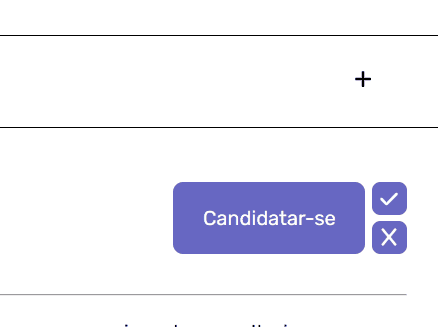
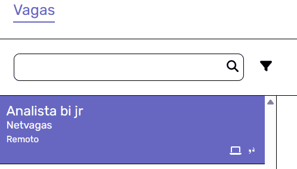
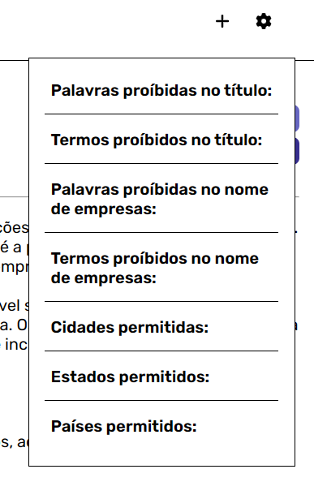
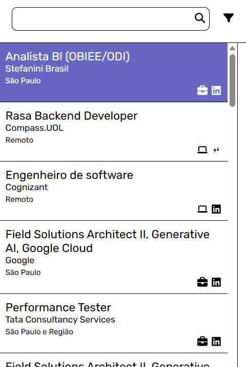

# Job Search Assistant
[](./README.md)

A simple Django application developed to assist people currently looking for a job, joining many listing sources in one place. (May get a few more features soon!)

This project's basic front-end was developed using HTML, CSS and JavaScript while the back-end was made with Python, Django and SQLite3 (for a simple data storage solution).

It's sources' integration modules were carefully made by analysing the inner workings between the client and server-side communication (API) on their websites, while implementing data extraction and web scraping techniques to gather the wanted data.
 
Job Search Assistant currently supports these sources:
- **LinkedIn**
- **Glassdoor**
- **Catho**
- **Vagas.com**

<br>

> ⚠️ **Warning**: Although I've implemented precautionary measures to avoid making a lot of requests at the same time and abusing sources' TOS, I'm NOT responsible for anything that happens to you while using this. Use at your own volition.


## How to setup
1. [Download](https://github.com/PedroTejon/Job-Search-Assistant/archive/refs/heads/main.zip) or clone this repository to a folder of your choice.
2. Open a terminal window on the project folder and run the following commands to install the required Python packages:
```cmd
    pip install -r requirements.txt
    playwright install
```
3. Run the authentication setup script to log-in on the sources with the command:
```cmd
    python auth_setup.py
```
4. Finally, start the application at http://localhost:8000 by running:
```cmd
    python manage.py runserver
```

## Features

**Receive your freshest job listings**: After accessing the web application, click on the plus sign in the top right corner of the screen to get your latest batch of job listings! If this is your first time running this feature, remember to add filters on the settings menu before running it to receive listings more attractive to you!

> ⚠️ **Warning** It's recommended to run this only once every few days, since it's quite heavy request-wise and it's not like you really thousands of job listings at the same time



The integration modules will obtain the following groups of listings from their sources:
- LinkedIn
  - Listings from followed companies
  - Recommended listings
  - Recommended remote listings
- Glassdoor
  - Listings from followed companies
  - Recommended listings
- Catho
  - Recommended listings
- Vagas.com
  - Listings from followed companies
  - Recommended listings

---

**Exclude listings with certain properties**: If you are getting job listings related to stuff you have no interest in, you can forbid certain listings from being chosen in the future by highlighting unique words or terms(strings of characters that may contain multiple words or may even be found inside another word, if you're not careful) on the listing's title, and choosing your option on the menu that pops up. 


You can also use this feature to forbid listings from those spammy companies by highlighting their name!



P.S.: Besides that, you can also manage what's forbidden and what's not on the extraction settings Menu, located besides the extraction button on the top right corner of the screen.



---

**Query through your listings database**: After using this app for some time, you may accumulate so many listings that it may become hard to navigate and find the one you're looking for, so you can use our querying options to find it for you amidst the sea of listings!



You may also mark listings as "Applied to" or "Dismissed", using the checkmark and x buttons to the right of the "Apply" button, to help distinguish them!

## Planned features (To-Do)
- [x] Listings extraction (LinkedIn, Glassdoor, Catho and Vagas.com)
- [x] Simple GUI with Django
- [ ] Add support to more sources
- [ ] Dashboard for more stats related to your job search journey (based on listings in database)
- [ ] Make an ease-of-use curriculum generator that also updates automatically your info on supported websites after changes