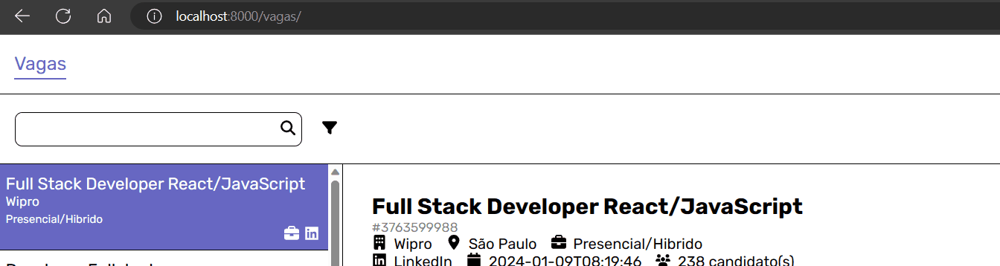
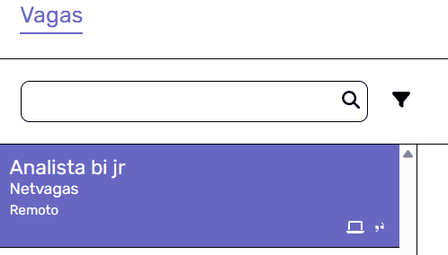
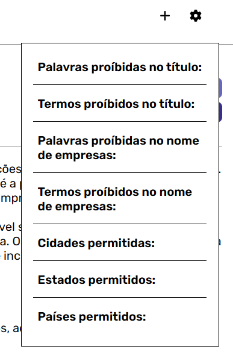
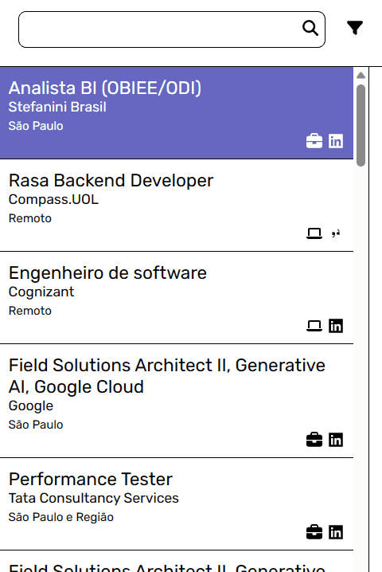

# Job Search Assistant
[](./README.en.md)

Uma aplicação em Django simples desenvolvida para ajudar pessoas atualmente à procura de trabalho, juntando vagas de diversas fontes de vagas diferentes em um só lugar. (Pode receber mais funções em breve!)

O front-end básico desse projeto foi desenvolvido usando HTML, CSS e JavaScript, enquanto o back-end foi feito com Python, Django e SQLite3 (para uma solução de armazenamento simples).

Seus módulos de integração de fontes foram cuidadosamente feitos ao analisar o funcionamento interno da comunicação entre o lado cliente e servidor (API) dessas fontes, com a implementação de técnicas de extração de dados e web scraping para extrair os dados desejados.
 
Job Search Assistant atualmente tem integração com estas fontes:
- **LinkedIn**
- **Glassdoor**
- **Catho**
- **Vagas.com**

<br>

> ⚠️ **Aviso**: Embora eu tenha implementado medidas de precaução para evitar fazer muitas requisições e abusar do TOS das fontes, eu NÃO me responsabilizo por qualquer coisa que aconteça com você enquanto usa este aplicativo. Utilize-o ciente disto.


## Como instalar
1. [Baixe](https://github.com/PedroTejon/Job-Search-Assistant/archive/refs/heads/main.zip) ou clone este repositório para um local de sua escolha.
2. Abra uma janela de terminal na pasta do projeto e rode os seguintes comandos para instalar os pacotes Python necessários:
```cmd
    pip install -r requirements.txt
    playwright install
```
3. Rode seguinte comando para executar o script de autenticação e logar nas fontes de vagas desejadas:
```cmd
    python auth_setup.py
```
4. Finalmente, depois de tudo isso, inicie a aplicação em http://localhost:8000 ao rodar:
```cmd
    python manage.py migrate (só é necessário usar esse comando uma vez na instalação e mais uma vez toda vez que atualizar o programa, para garantir que tudo foi aplicado corretamente)
    python manage.py runserver
```

## Funcionalidades

**Obtenha as vagas mais fresquinhas**: Após acessar a aplicação web, clique no símbolo de mais no canto superior direito da tela para receber sua encomenda de vagas recentes! Se for a primeira vez que você está executando essa função, lembre-se de adicionar filtros no menu de configurações antes de executá-la para obter vagas mais atraentes para você!

> ⚠️ **Aviso** É recomendado executar isso uma vez a cada alguns dias, já que faz muitas requisições e não é como se você precisasse ter milhares de vagas ao mesmo tempo. Mais uma coisa, evite usar isto antes ou depois de seguir um monte de gente no LinkedIn, isso pode te fazer parecer um bot para o site.


Os módulos de integração irão obter os seguintes grupos de vagas de suas fontes:
- LinkedIn
  - Vagas de empresas seguidas
  - Vagas recomendadas
  - Vagas remotas recomendadas
- Glassdoor
  - Vagas de empresas seguidas
  - Vagas recomendadas
- Catho
  - Vagas recomendadas
- Vagas.com
  - Vagas de empresas seguidas
  - Vagas recomendadas

---
<br>

**Exclua vagas com certas características**: Se você está recebendo vagas relacionadas a coisas que você não possui interesse, você pode proibir certas vagas de serem recebidas no futuro ao selecionar palavras únicas no título ou termos (cadeias de caracteres que podem conter várias palavras ou que pode até ser encontrada dentro de outras palavras, se você não tomar cuidado) no título da vaga, e escolhendo qual opção você quer no menu que aparecerá.



Você também pode usar essa funcionalidade para proibir vagas daquelas empresas que ficam spammando seu LinkedIn ao selecionar o nome delas!



P.S.: Além disso, você pode gerenciar o que está proíbido ou não está no menu de configurações de extração, que fica do lado do botão de extração no topo superior direito da tela.



---
<br>

**Consulte as vagas locais**: Após usar esse aplicativo por um tempo, você pode acabar acumulando tantas vagas que pode acabar ficando difícil navegar e encontrar a vaga certa para você, então você pode usar nossas opções de consulta para encontrá-la nesse mar de vagas!



Você também pode marcar vagas como "Inscrito" e "Dispensada", usando os botões à direita do botão de "Cadastre-se", para ajudar a diferenciá-las!

## Funcionalidades planejadas (To-Do)
- [x] Extração de vagas (LinkedIn, Glassdoor, Catho and Vagas.com)
- [x] GUI simples com Django
- [ ] Adicionar suporte para mais fontes
- [ ] Dashboard para visualizar mais estatísticas de sua jornada procurando emprego (com base nas vagas no banco de dados)
- [ ] Fazer um gerador de currículo simples de se usar que também atualiza automaticamente suas informações em sites suportados após mudanças